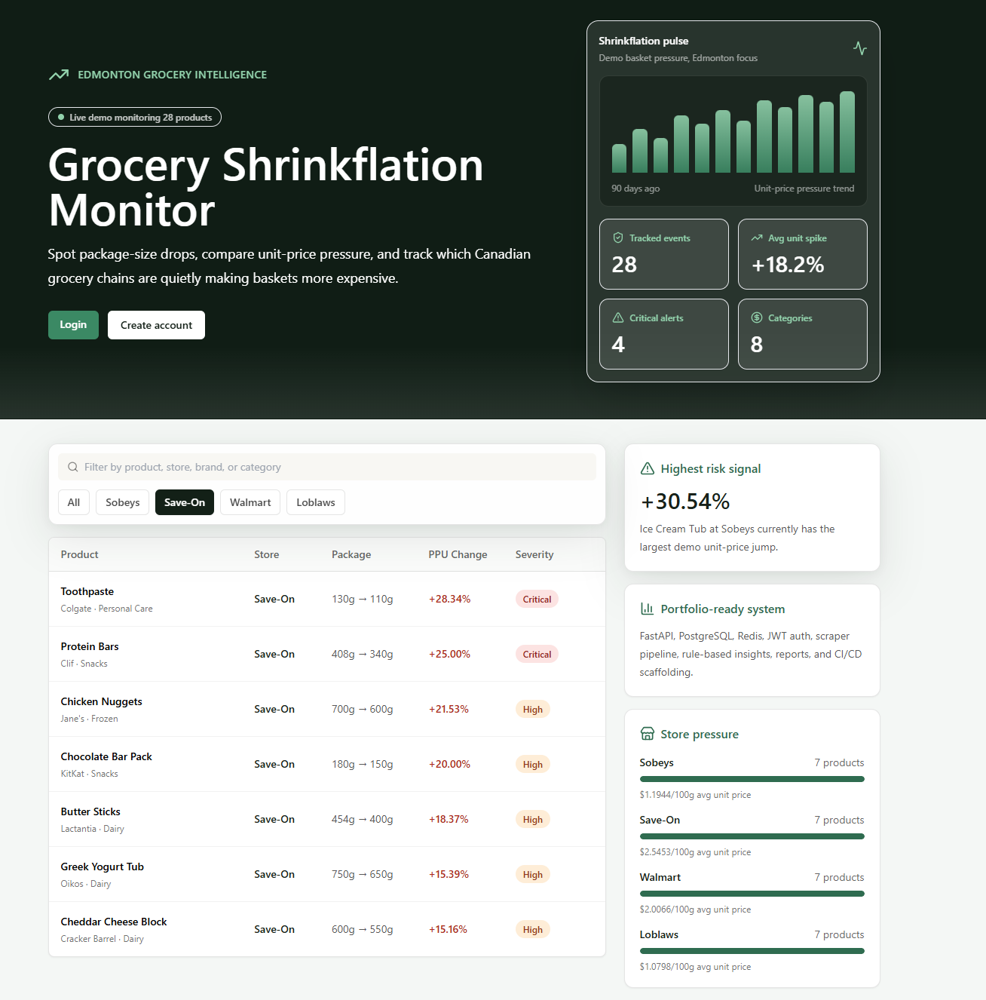
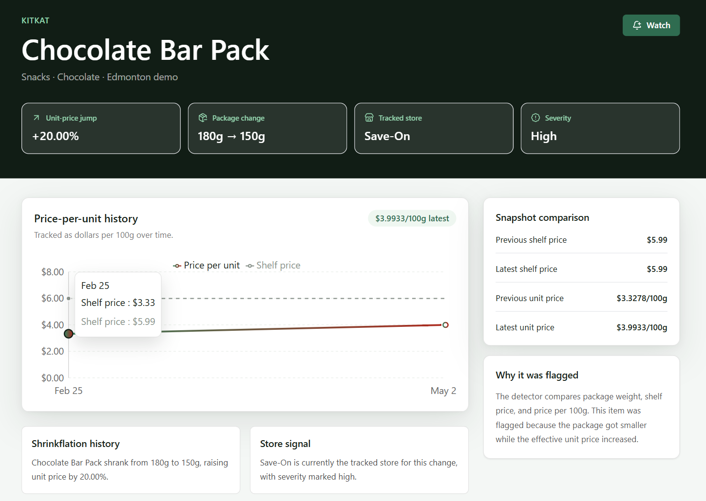
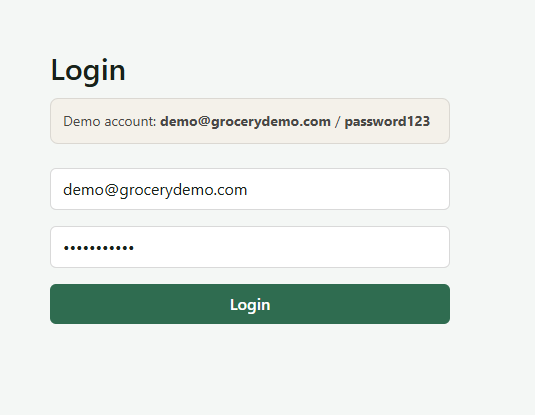
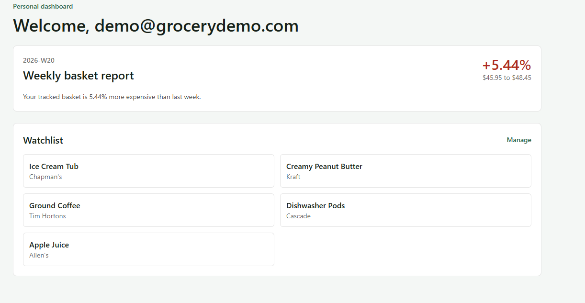

<div align="center">

# Grocery Shrinkflation Monitor

### Shrinkflation is silent. This dashboard isn't.

> A production-grade, full-stack SaaS analytics platform that automatically detects when Canadian grocery products shrink in size while prices stay the same or quietly climb higher.

<br/>

[](https://nextjs.org)
[](https://fastapi.tiangolo.com)
[](https://www.typescriptlang.org)
[](https://python.org)
[](https://postgresql.org)
[](https://docker.com)
[](https://github.com/features/actions)

<br/>


</div>

---

## Screenshots

### Public Analytics Dashboard
<p align="center">
 
</p>

### Product Intelligence & Historical Unit-Price Tracking
<p align="center">
 
</p>

### Authentication Flow
<p align="center">
 
</p>

### User Dashboard & Weekly Basket Report
<p align="center">
 
</p>

---

## Why I Built This

While grocery shopping, I kept noticing that products felt smaller but the prices hadn't changed. A cereal box down from 500g to 420g. A juice carton quietly dropping from 1L to 946mL. No announcement. No sticker change.

Most consumers compare shelf prices. Almost nobody compares:
- grams or milliliters over time
- price-per-unit across stores
- historical package-size snapshots

I built this to make those hidden changes visible and to solve real engineering problems along the way: inconsistent retail data, unit normalization, snapshot diffing, noise filtering, typed API contracts, and scalable SaaS architecture.

---

## Core Features

### Shrinkflation Detection Engine
Detects package-size reductions, price-per-unit increases, and long-term pricing pressure. Every event is assigned a severity level **Low, Moderate, High, or Critical** based on size drop percentage and effective unit-price increase.

### Public Analytics Dashboard
Store comparison metrics, a severity-ranked leaderboard, category rollups, search & filtering, and historical trend tracking. Frontend filtering runs client-side for instant interaction with no unnecessary API calls.

### Product Intelligence Pages
Each product page shows historical package-size changes, a Recharts price-per-unit timeline, severity analysis, store-level pressure, and snapshot comparisons alongside auto-generated natural-language insights.

### SaaS-Style User Features
JWT authentication, refresh-token cookie structure, personal watchlists, weekly basket reports, and alert-ready infrastructure. A preloaded demo account makes the platform behave like a live production SaaS system.

### Rule-Based Insight Engine
Generates plain-English explanations without external AI APIs:
> *"Ice Cream Tub shrank from 2000g to 1650g, increasing unit price by 30.54%."*

Insights are generated for products, stores, categories, and weekly basket reports.

### Demo Fallback Architecture
The app runs fully without PostgreSQL or Redis using a realistic 28-product fallback dataset with seeded analytics, mock snapshots, and preloaded watchlists. The real production architecture is ready to swap in instantly.

---

## System Architecture

```
Retail product snapshots

Scraper ingestion pipeline

Normalization engine standardizes units (g, mL, kg, L)

Historical product snapshots stored

Detection engine compares size + price-per-unit changes

Severity scoring + insight generation

FastAPI serves analytics endpoints

Next.js dashboard visualizes trends
```

---

## Tech Stack

| Layer | Technology |
|---|---|
| Frontend | Next.js 15 (App Router), React, TypeScript, Tailwind CSS |
| Backend | FastAPI, Python 3.12, SQLAlchemy, Pydantic v2 |
| Charts | Recharts |
| Database | PostgreSQL (Neon for prod) |
| Cache | Redis (Upstash for prod) |
| Auth | JWT + HTTP-only refresh cookie structure |
| Data Pipeline | Python normalization & shrinkflation detection pipeline |
| DevOps | Docker, Docker Compose, GitHub Actions |
| Monitoring | Sentry-ready, Resend for email |
| Quality | pytest, ruff, pyright, ESLint, Next.js build checks |

---

## The Detection Algorithm Deep Dive

The hardest engineering challenge was building a detection pipeline reliable enough for **messy, real-world grocery data**.

Products list sizes as `"1 kg"`, `"1000g"`, `"2 × 500g"`, or `"35.2 oz"`. Prices fluctuate from weekly sales. Brands quietly rename SKUs. A naive diff generates false positives constantly.

Here's how the pipeline handles it:

```
Raw Scraped Data


Unit Normalization Converts all sizes to g or mL.
 Handles multi-packs, ozg, LmL.


Price-Per-Unit Calc Cost per 100g / 100mL per snapshot.


Snapshot Diffing Old vs. new comparison per product per store.


Noise Filtering Ignores sales, rounding artifacts, label changes.


Severity Scoring Weighted: % size drop + % PPU increase + recency.


Insight Generation "Package shrank 12.5% while cost per 100g rose 18%."
```

The same pipeline runs against real scraped data **or** the demo fallback keeping the full production architecture validated during local development.

---

## Repository Structure

```
shrinkflation-monitor/
 .github/
 workflows/
 ci.yml
 scraper.yml
 deploy.yml
 api/
 auth/
 middleware/
 routes/
 tests/
 cache.py
 config.py
 database.py
 demo_data.py
 main.py
 models.py
 schemas.py
 db/
 migrations/
 frontend/
 app/
 components/
 lib/
 Dockerfile
 package.json
 insights/
 basket_insights.py
 category_insights.py
 product_insights.py
 store_insights.py
 scraper/
 spiders/
 detector.py
 normalizer.py
 scheduler.py
 seed_demo_data.py
 workers/
 alert_dispatcher.py
 insight_refresher.py
 report_generator.py
 docker-compose.yml
 docker-compose.prod.yml
 Makefile
 pyproject.toml
```

---

## API Reference

### Public Analytics

| Method | Endpoint | Description |
|---|---|---|
| `GET` | `/health` | Backend health check |
| `GET` | `/public/leaderboard` | Highest-severity shrinkflation events |
| `GET` | `/public/stores/comparison` | Store-level pricing pressure |
| `GET` | `/public/categories/rollup` | Category analytics |
| `GET` | `/products` | Product listing |
| `GET` | `/products/{product_id}` | Product details |
| `GET` | `/products/{product_id}/history` | Historical snapshots |

### Insights

| Method | Endpoint | Description |
|---|---|---|
| `GET` | `/insights/product/{product_id}` | Product-level insights |
| `GET` | `/insights/stores` | Store-level insights |
| `GET` | `/insights/categories` | Category-level insights |

### Auth

| Method | Endpoint |
|---|---|
| `POST` | `/auth/register` |
| `POST` | `/auth/login` |
| `POST` | `/auth/refresh` |
| `POST` | `/auth/logout` |
| `GET` | `/auth/me` |

### User Features

| Method | Endpoint |
|---|---|
| `GET` / `POST` / `DELETE` | `/watchlist` / `/watchlist/{product_id}` |
| `GET` | `/alerts` |
| `GET` | `/reports/weekly` |

---

## Getting Started

### Prerequisites
- Python 3.12+
- Node.js 18+
- Docker *(optional)*

### 1. Clone

```bash
git clone https://github.com/YOUR_USERNAME/shrinkflation-monitor.git
cd shrinkflation-monitor
```

### 2. Backend

```bash
pip install -e ".[dev]"
cp .env.example .env
uvicorn api.main:app --reload --host 127.0.0.1 --port 8001
```

### 3. Frontend *(new terminal)*

```bash
cd frontend
npm install
NEXT_PUBLIC_API_BASE_URL=http://127.0.0.1:8001 npm run dev -- --port 3001
```

### 4. Open

```
http://localhost:3001
```

> **Zero setup required.** Runs on a built-in 28-product demo dataset no database needed.
